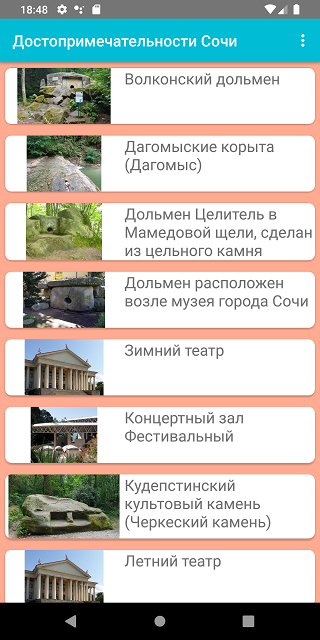
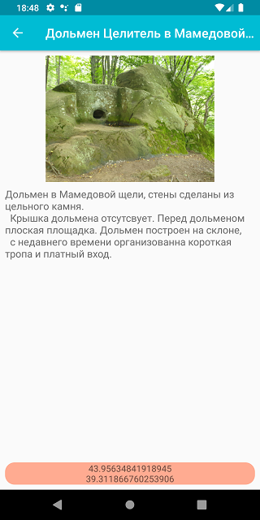

##AFOOT

ver 2.3
MVVM; Room; Volley

Достопримечательности  СОЧИ

Путешествия

Ваш надежный спутник в путешествиях по большому СОЧИ

Ваш надежный спутник в путешествиях по большому СОЧИ. Популярные и неизвестные, доступные и далекие, природные и рукотворные достопримечательности большого СОЧИ.
В СОЧИ уникальный климат, уникальный флора и уникальный ландшафт. Памятники природы — водопады, горные тропы, каньоны.
Тут сохранились памятники дольменной культуры (2 000 л. до н.э.).
Современные культурные объекты и монастыри.
В Сочи есть все для занятия спортом.
Все эти достопримечательности в Вашем кармане.

БЕСПЛАТНО
Абсолютно бесплатно скачайте и используйте наш путеводитель по большому СОЧИ.

ДЕТАЛЬНОЕ ОПИСАНИЕ
Все достопримечательности имеют  описание, которое позволит выбрать интересные точки. И спланировать маршруты.

ПЕРЕХОД К НАВИГАЦИИ
В экране с детальным описанием, нажатие на координаты открывает карту с построенным маршрутом. Внимание, к некоторым  точкам невозможно доехать, в описании есть информация о подробности маршрутах.
